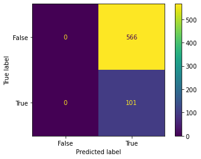
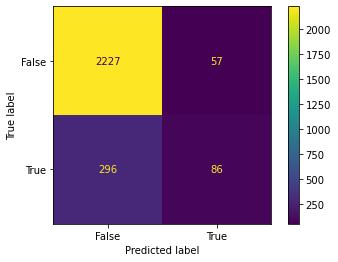

# PHASE 3 PROJECT: SYRIA TELECOMMUNICATIONS CUSTOMER CHURN PROJECT
# Done by: Edwin Mbuthia

# 1. BUSINESS UNDERSTANDING
SyriaTel is one of the leading telecommunications providers in Syria, established in 2000. It operates as a mobile network operator and is renowned for offering a wide range of telecommunication services, including mobile voice, data, and internet services across Syria. SyriaTel has played a pivotal role in the development of the country's telecommunications infrastructure, providing comprehensive coverage to both urban and rural areas. The company focuses on enhancing customer experience through innovative solutions, competitive pricing, and expanding its service offerings to meet the evolving needs of its customers. Despite the challenges posed by the ongoing conflict and economic difficulties in Syria, SyriaTel has managed to maintain its operations and continues to invest in network expansion and technological upgrades. Its mission is to connect people and improve lives by providing reliable and affordable telecommunication services, thereby contributing to the socio-economic development of Syria.
# 1.1 Business Problem
Syria Telcom seek to predict whether their customers will soon leave the company and shift to a different telco. High customer churn rates directly impact the revenue and profitability of telecommunications companies. Therefore, understanding the factors that contribute to churn  would allow Syria telco to take proactive measures, such as targeted marketing, loyalty programs, or customer service improvements, to retain customers.
# 1.2 Objectives
- Develop a Predictive Model for Custmer Churn: The primary objective of this project is to build a Machine Learning classifier that predicts whether a customer will soon stop doing business with SyriaTel. The predictive capability of the model will minimize customer loss and stabilize the customer base hence reducing revenue loss.
- Drivers of Customer Churn: Second goal is to identify the factors that would result into high customer churn.
- Analyze Churn Trends across Different States: The last objective of this project if to examine churn trends across different states to better understand which states are likely to have high churn rates.

# 2. Data Understanding
I will first import all the necessary libraries that we will require to conduct the project.

##### I explored the dataset to gain more insights.

I use the `.info()` method is used in Pandas to view the
1. **Number of Rows**
2. **Number of Columns**
3. **Column Names**
4. **Non-Null Count**
5. **Data Type of Each Column**

## 2.1 Data Description

state: Categorical variable indicating the customer's state.

account length: Numeric variable indicating the length of the customer account.

area code: Numeric variable indicating the area code of the customer.

phone number: Categorical variable (likely to be excluded as it won't contribute to churn prediction).

international plan: Categorical variable indicating if the customer has an international plan.

voice mail plan: Categorical variable indicating if the customer has a voicemail plan.

number vmail messages: Numeric variable indicating the number of voicemail messages.

total day/eve/night/intl minutes: Numeric variables indicating usage minutes in various time segments.

total day/eve/night/intl calls: Numeric variables indicating the number of calls in various time segments.

total day/eve/night/intl charge: Numeric variables indicating charges in various time segments.

customer service calls: Numeric variable indicating the number of customer service calls made by the customer.

churn: Binary target variable indicating customer churn (True/False).

# 3.0 Data Exploration & Preparation
In this bit I looked for any missing values in my dataset, removed any irrelevant columnns & converted categorical variables into numerical variables.
Dropped the phone number as it was insignificant in predicting whether or not customers were likely to leave SyriaTel.
I then combined the total day minutes, total evening minutes, total night minutes and the total international minutes columns to come up with a Total minutes column. I also combined the total day charge, total evening charge, total night charge and the total international charge columns to come up with a Total charges column. Combined the total day calls, total evening calls, total night calls and the total international calls columns to come up with a Total calls column.

## Explore Categorical Variables
Here i explored categorical data within my dataset. Found three categorical columns namely; State, International Plan and Voice mail plan.

There were no missing values in the categorical columns.

## Explore the Numerical variables
### Summary of numerical variables
#### .There are 6 numerical variables.
#### .These are given by account length, number of voice mail messages, customer service calls, total minutes, total charges and total calls.
##### .All of the numerical variables are of continuous type.

## 3.1 Data Preprocessing
In this section, using OneHot Encoder, I created a new binary column for each unique category, with 1 indicating the presence of the category and 0 otherwise. I first checked my target variable column amd found out it's binary so there was no point of Encoding.

I then split my data into train and test datasets.

## 4. Modelling
### 4.1 What is the goal of Machine Learning?
The goal is to help SyriaTel proactively identify customers who are at risk of leaving, allowing the company to intervene and reduce churn, which is critical for maintaining revenue and market share.

Accurately predicting whether or not a customer is going to leave SyriaTel would help the company take steps to try and retain the customers.The model would also help allocate resources to the right customers. Those who aren't likely to leave the company.

It would also help the company address the various painpoints that are most likely going to lead to customer churn.

For this project, I will build several models using different classifiers and then compare the performance metrics to choose the best classifier. These will be:

- Logistic Regression
- Decision Tree Classifier
- Cross-validation modelling

### 4.2 Test-Train-Split
I will first perform a test train test split of my data. The training set will be 80% and the testing set 20%. Then set the random state to 42 to ensure reproducibility.

Before modelling, i will first determine what to expect to get with a 'dummy' model that always predicts a customer will leave the company(True).
0(False) will represent the likelihood of retaining a customer while 1(True) represents the likelihood of a customer leaving.

Since I am going to use the test data to model, i will use the test data here.

array([566, 101], dtype=int64)
From the above code block, it is evident that the target is imbalanced. I will then calculate different classification metrics to evaluate the model's performance for the True and False labels.

Below is the confusion matrix: 

For the baseline metrics, I will assume that the model always chooses 1.
baseline_accuracy: 0.15142428785607195
baseline_precision: 0.15142428785607195
baseline_recall: 1.0
baseline_f1score: 0.2630208333333333

### 4.4 Instantiate & Fit a Logistic Regression Model

I will then use the LogisticRegression model from scikit-learn, specify a random state of 42 as well as and use default hyperparameters.

I will then use the scaled data to fit the model and i will also display the confusion matrix.

