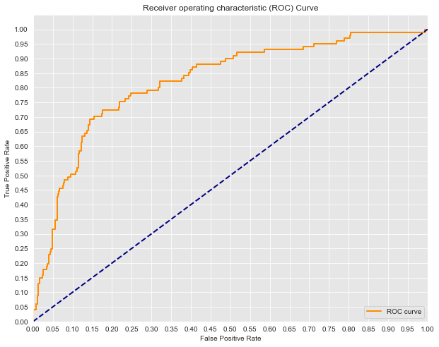
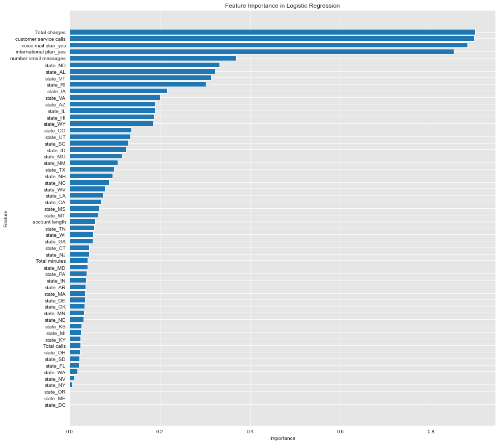
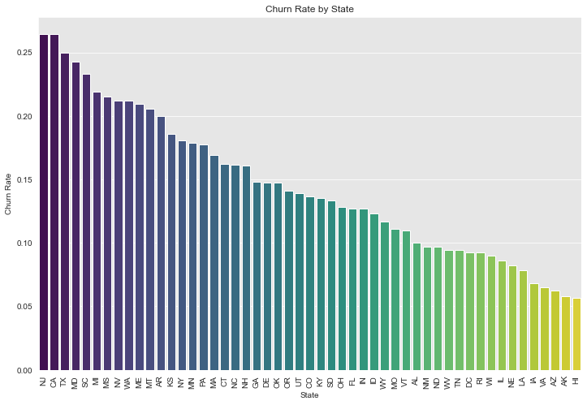

# PHASE 3 PROJECT: SYRIA TELECOMMUNICATIONS CUSTOMER CHURN PROJECT
# Done by: Edwin Mbuthia

# 1. BUSINESS UNDERSTANDING
SyriaTel is one of the leading telecommunications providers in Syria, established in 2000. It operates as a mobile network operator and is renowned for offering a wide range of telecommunication services, including mobile voice, data, and internet services across Syria. SyriaTel has played a pivotal role in the development of the country's telecommunications infrastructure, providing comprehensive coverage to both urban and rural areas. The company focuses on enhancing customer experience through innovative solutions, competitive pricing, and expanding its service offerings to meet the evolving needs of its customers. Despite the challenges posed by the ongoing conflict and economic difficulties in Syria, SyriaTel has managed to maintain its operations and continues to invest in network expansion and technological upgrades. Its mission is to connect people and improve lives by providing reliable and affordable telecommunication services, thereby contributing to the socio-economic development of Syria.
# 1.1 Business Problem
Syria Telcom seek to predict whether their customers will soon leave the company and shift to a different telco. High customer churn rates directly impact the revenue and profitability of telecommunications companies. Therefore, understanding the factors that contribute to churn  would allow Syria telco to take proactive measures, such as targeted marketing, loyalty programs, or customer service improvements, to retain customers.
# 1.2 Objectives
- Develop a Predictive Model for Custmer Churn: The primary objective of this project is to build a Machine Learning classifier that predicts whether a customer will soon stop doing business with SyriaTel. The predictive capability of the model will minimize customer loss and stabilize the customer base hence reducing revenue loss.
- Drivers of Customer Churn: Second goal is to identify the factors that would result into high customer churn.
- Analyze Churn Trends across Different States: The last objective of this project if to examine churn trends across different states to better understand which states are likely to have high churn rates.

# 2. Data Understanding
I will first import all the necessary libraries that we will require to conduct the project.

##### I explored the dataset to gain more insights.

I use the `.info()` method is used in Pandas to view the
1. **Number of Rows**
2. **Number of Columns**
3. **Column Names**
4. **Non-Null Count**
5. **Data Type of Each Column**

## 2.1 Data Description

state: Categorical variable indicating the customer's state.

account length: Numeric variable indicating the length of the customer account.

area code: Numeric variable indicating the area code of the customer.

phone number: Categorical variable (likely to be excluded as it won't contribute to churn prediction).

international plan: Categorical variable indicating if the customer has an international plan.

voice mail plan: Categorical variable indicating if the customer has a voicemail plan.

number vmail messages: Numeric variable indicating the number of voicemail messages.

total day/eve/night/intl minutes: Numeric variables indicating usage minutes in various time segments.

total day/eve/night/intl calls: Numeric variables indicating the number of calls in various time segments.

total day/eve/night/intl charge: Numeric variables indicating charges in various time segments.

customer service calls: Numeric variable indicating the number of customer service calls made by the customer.

churn: Binary target variable indicating customer churn (True/False).

# 3.0 Data Exploration & Preparation
In this bit I looked for any missing values in my dataset, removed any irrelevant columnns & converted categorical variables into numerical variables.
Dropped the phone number as it was insignificant in predicting whether or not customers were likely to leave SyriaTel.
I then combined the total day minutes, total evening minutes, total night minutes and the total international minutes columns to come up with a Total minutes column. I also combined the total day charge, total evening charge, total night charge and the total international charge columns to come up with a Total charges column. Combined the total day calls, total evening calls, total night calls and the total international calls columns to come up with a Total calls column.

## Explore Categorical Variables
Here i explored categorical data within my dataset. Found three categorical columns namely; State, International Plan and Voice mail plan.

There were no missing values in the categorical columns.

## Explore the Numerical variables
### Summary of numerical variables
#### .There are 6 numerical variables.
#### .These are given by account length, number of voice mail messages, customer service calls, total minutes, total charges and total calls.
##### .All of the numerical variables are of continuous type.

## 3.1 Data Preprocessing
In this section, using OneHot Encoder, I created a new binary column for each unique category, with 1 indicating the presence of the category and 0 otherwise. I first checked my target variable column amd found out it's binary so there was no point of Encoding.

I then split my data into train and test datasets.

## 4. Modelling
### 4.1 What is the goal of Machine Learning?
The goal is to help SyriaTel proactively identify customers who are at risk of leaving, allowing the company to intervene and reduce churn, which is critical for maintaining revenue and market share.

Accurately predicting whether or not a customer is going to leave SyriaTel would help the company take steps to try and retain the customers.The model would also help allocate resources to the right customers. Those who aren't likely to leave the company.

It would also help the company address the various painpoints that are most likely going to lead to customer churn.

For this project, I will build several models using different classifiers and then compare the performance metrics to choose the best classifier. These will be:

- Logistic Regression
- Decision Tree Classifier
- Cross-validation modelling

### 4.2 Test-Train-Split
I will first perform a test train test split of my data. The training set will be 80% and the testing set 20%. Then set the random state to 42 to ensure reproducibility.

Before modelling, i will first determine what to expect to get with a 'dummy' model that always predicts a customer will leave the company(True).
0(False) will represent the likelihood of retaining a customer while 1(True) represents the likelihood of a customer leaving.

Since I am going to use the test data to model, i will use the test data here.

array([566, 101], dtype=int64)
From the above code block, it is evident that the target is imbalanced. I will then calculate different classification metrics to evaluate the model's performance for the True and False labels.

Below is the confusion matrix: 

For the baseline metrics, I will assume that the model always chooses 1.
baseline_accuracy: 0.15142428785607195
baseline_precision: 0.15142428785607195
baseline_recall: 1.0
baseline_f1score: 0.2630208333333333

### 4.4 Instantiate & Fit a Logistic Regression Model

I will then use the LogisticRegression model from scikit-learn, specify a random state of 42 as well as and use default hyperparameters.

I will then use the scaled data to fit the model and i will also display the confusion matrix.

#### Compare the Baseline & Fitted Model Scores

I will now use the test data to calculate the accuracy, recall, precision and f1scores of the fitted model.

Accuracy
Baseline: 0.151 Fitted Model: 0.850
Recall
Baseline: 1.000 Fitted Model: 0.178
Precision
Baseline: 0.151 Fitted Model: 0.514
F1 Score
Baseline: 0.263 Fitted Model: 0.265

cv: 0.860836477854839

### Outcome Analysis

1. **Accuracy**
   - **Baseline: 0.151 (15.1%)**  
     The baseline model has an accuracy of 15.1%, which suggests it is only slightly better than random guessing. This low accuracy indicates that the baseline model is not effective at predicting the correct outcomes.
   - **Fitted Model: 0.850 (85%)**  
     The fitted model, with an accuracy of 85%, is significantly better, correctly predicting 85% of the instances. This substantial improvement indicates that the fitted model is far more effective at making accurate predictions compared to the baseline.

2. **Recall**
   - **Baseline: 1.000 (100%)**  
     The recall for the baseline model is 100%, meaning it correctly identifies all positive instances in the dataset. However, this might also indicate that the baseline model predicts "positive" for almost every instance, which could lead to other metrics being low.
   - **Fitted Model: 0.178 (17.8%)**  
     The fitted model's recall is much lower at 17.8%, suggesting it is missing many true positive instances. This indicates that while the fitted model is accurate overall, it may not be good at capturing all actual positive cases. This could be due to a conservative approach where the model favors precision or is tuned to minimize false positives.

3. **Precision**
   - **Baseline: 0.151 (15.1%)**  
     The baseline model's precision is 15.1%, indicating that only a small fraction of the predicted positives are actually true positives. This is consistent with a model that classifies most instances as positive to achieve high recall.
   - **Fitted Model: 0.514 (51.4%)**  
     The fitted model has a much higher precision of 51.4%, meaning that more than half of the positive predictions made by the model are correct. This shows that while the fitted model is more selective in predicting positives, it does so more accurately than the baseline model.

4. **F1 Score**
   - **Baseline: 0.263 (26.3%)**  
     The baseline model has an F1 score of 26.3%, which is low and reflects the imbalance between its high recall and low precision.
   - **Fitted Model: 0.265 (26.5%)**  
     The F1 score for the fitted model is only slightly higher at 26.5%. This suggests that while the fitted model balances precision and recall better than the baseline, it still struggles with maintaining high performance across both metrics. This could indicate class imbalance or that the model's decision threshold might need adjustment.

5. **Cross-Validation (CV) Score: 0.86 (86%)**
   - The CV score of 0.86 shows that the model's expected accuracy on unseen data is 86%, which aligns well with the fitted model's accuracy score (0.85). This indicates the model generalizes well and suggests that overfitting is not a major concern.

### Key Insights

- **Accuracy Improvement**: The fitted model has a significantly higher accuracy than the baseline, indicating it is much better at predicting the correct outcomes overall.
- **Trade-off Between Recall and Precision**: The baseline model has a perfect recall but poor precision, meaning it identifies all actual positives but at the cost of many false positives. The fitted model, however, has much better precision but lower recall, suggesting it is more conservative and focuses on reducing false positives.
- **F1 Score Analysis**: The F1 score for both models is relatively low, which suggests there is still room for improvement in balancing precision and recall. The slight improvement over the baseline indicates the fitted model's predictions are slightly more balanced but still not optimal.
- **Generalization Performance**: The high CV score (0.86) suggests that, despite some weaknesses in recall, the model is likely to perform well on new data.

### Suggestions for Improvement of the model
- **Handle Class Imbalance**: If there is an imbalance in the dataset (e.g., more negatives than positives), consider using techniques like oversampling, undersampling, or using algorithms that handle class imbalance better.

#### 4.5 **Dealing with the imbalanced data**

I will first find the class imbalance in the train and test data.
#### 4.5 **Dealing with the imbalanced data**

I will first find the class imbalance in the train and test data.

False    2284
True      382
Name: churn, dtype: int64

False    566
True     101
Name: churn, dtype: int64

y_score =model.decision_function(X_test)
# False positive rate and true positive rate
fpr, tpr, thresholds = roc_curve(y_test, y_score)

# Seaborn's beautiful styling
sns.set_style('darkgrid', {'axes.facecolor': '0.9'})

# Print AUC
print('AUC: {}'.format(auc(fpr, tpr)))

# Plot the ROC curve
plt.figure(figsize=(10, 8))
lw = 2
plt.plot(fpr, tpr, color='darkorange',
         lw=lw, label='ROC curve')
plt.plot([0, 1], [0, 1], color='navy', lw=lw, linestyle='--')
plt.xlim([0.0, 1.0])
plt.ylim([0.0, 1.05])
plt.yticks([i/20.0 for i in range(21)])
plt.xticks([i/20.0 for i in range(21)])
plt.xlabel('False Positive Rate')
plt.ylabel('True Positive Rate')
plt.title('Receiver operating characteristic (ROC) Curve')
plt.legend(loc='lower right')
plt.show()

This graph is a **Receiver Operating Characteristic (ROC) Curve**, a tool used to evaluate the performance of a binary classification model.

### Key Elements of the ROC Curve:
1. **True Positive Rate (TPR)** (y-axis): Also known as sensitivity or recall, this measures the proportion of actual positives correctly identified by the model.
2. **False Positive Rate (FPR)** (x-axis): This measures the proportion of actual negatives that were incorrectly identified as positive by the model.

### Explanation of the Graph:
- **Orange Line**: Represents the ROC curve, which plots the TPR against the FPR at various threshold settings. The curve shows the trade-off between sensitivity and specificity (True Negative Rate) across different thresholds.
- **Diagonal Blue Line**: Represents a random classifier with no predictive power, which would give a line at a 45-degree angle (i.e., TPR = FPR). A model whose ROC curve is close to this line is no better than random guessing.
- **Area Under the Curve (AUC = 0.82)**: The AUC value is 0.82, indicating that the model has a good ability to distinguish between the two classes. An AUC value of 1.0 represents a perfect model, while an AUC value of 0.5 suggests a model with no discriminative power.

## Oversampling and Undersampling to handle Imbalance
# Define SMOTE for oversampling
smote = SMOTE(sampling_strategy=0.5, random_state=42)  # You can adjust the sampling_strategy

# Define RandomUnderSampler for undersampling
undersample = RandomUnderSampler(sampling_strategy=0.75, random_state=42)  # Adjust sampling_strategy for desired balance

# Create a pipeline that combines both
pipeline = Pipeline(steps=[('smote', smote), ('undersample', undersample)])
X_train_resampled, y_train_resampled = pipeline.fit_resample(X_train, y_train)
model = LogisticRegression(random_state=42)
model.fit(X_train_resampled, y_train_resampled)
y_pred = model.predict(X_test)
print(confusion_matrix(y_test, y_pred))
print(classification_report(y_test, y_pred))

[[474  92]
 [ 33  68]]
              precision    recall  f1-score   support

       False       0.93      0.84      0.88       566
        True       0.42      0.67      0.52       101

    accuracy                           0.81       667
   macro avg       0.68      0.76      0.70       667
weighted avg       0.86      0.81      0.83       667

Balanced Improvement: The application of oversampling and undersampling techniques has led to a more balanced performance across the two classes. The model's ability to detect True instances has improved, reducing the bias toward the majority class (False).

## Modelling using Decision Trees
dt_accuracy = accuracy_score(y_test,y_pred)
dt_recall = recall_score(y_test,y_pred)
dt_precision = precision_score(y_test,y_pred)
dt_f1score = f1_score(y_test,y_pred)

print(f"""
Accuracy
Baseline: {baseline_accuracy:1.3f} Fitted Model: {model_accuracy:1.3f} Decision Tree: {dt_accuracy:1.3f}
Recall 
Baseline: {baseline_recall:1.3f} Fitted Model: {model_recall:1.3f} Decision Tree: {dt_recall:1.3f}
Precision
Baseline: {baseline_precision:1.3f} Fitted Model: {model_precision:1.3f} Decision Tree: {dt_precision:1.3f}
F1_score: {baseline_f1score:.3f} Fitted Model: {model_f1score:.3f} Decision Tree: {dt_f1score:.3f}""")

Accuracy
Baseline: 0.151 Fitted Model: 0.850 Decision Tree: 0.919
Recall 
Baseline: 1.000 Fitted Model: 0.178 Decision Tree: 0.723
Precision
Baseline: 0.151 Fitted Model: 0.514 Decision Tree: 0.737
F1_score: 0.263 Fitted Model: 0.265 Decision Tree: 0.730

Based on these metrics:

- **Decision Tree**: Has the highest accuracy (0.919), recall (0.723), precision (0.737), and F1 score (0.730). This indicates that the Decision Tree performs best in terms of balancing these metrics.

- **Fitted Model**: Shows decent precision and recall but lower accuracy and F1 score compared to the Decision Tree.

- **Baseline**: Has very low scores across all metrics, which suggests it is not performing well.

## 5. **Recommendations**

### 1.**Model to use** 
Based on the metrics, the **Decision Tree** model appears to be the best option overall, as it provides the highest scores across accuracy, recall, precision, and F1 score. Decision Tree seems to offer the most balanced performance here.

### 2.**Identify Drivers of Customer Churn**
To identify the factors contributing to high customer churn, you can use feature importance scores or coefficients from the model. Feature importance from a Random Forest model or coefficients from a Logistic Regression model can indicate which features most strongly impact churn.

# Getting the coefficients of the model
coefficients = model.coef_[0]  # For binary classification, it's a 1D array

# Creating a DataFrame for better visualization
feature_importance_df = pd.DataFrame({
    'Feature': X_train.columns,
    'Importance': np.abs(coefficients)  
})

# Sorting by the most important features
feature_importance_df = feature_importance_df.sort_values(by='Importance', ascending=False)

plt.figure(figsize=(15,15))
plt.barh(feature_importance_df['Feature'], feature_importance_df['Importance'])
plt.xlabel('Importance')
plt.ylabel('Feature')
plt.title('Feature Importance in Logistic Regression')
plt.gca().invert_yaxis()
plt.show()

### Key Drivers likely to lead to customer Churn are;

**Total Charges**: This is the most important feature. Customers with higher total charges are more likely to churn. 
**Action**: Implement targeted discounts or loyalty rewards for high-billing customers. Offer bundled services at a reduced rate to decrease the perceived cost.

**Customer Service Calls**: A high number of customer service calls indicates dissatisfaction or unresolved issues. 
**Action**: Improve customer service quality by training staff, reducing response times, and resolving issues on the first call. Implement a proactive approach by contacting customers with high call volumes to check their satisfaction levels.

**Voice Mail Plan and International Plan**: The presence of a voice mail plan or international plan correlates with churn. 
**Action**: Re-evaluate the pricing or value of these plans. Consider offering better value-added services or bundles that encourage customers to keep these plans.

**Number of Voicemail Messages**: A higher number of voicemail messages could indicate that customers are not using modern communication features or are facing issues. 
**Action**: Educate customers about newer, more efficient communication methods and offer incentives for switching to them.

**Geographic Factors (States)**: Several states (e.g., ND, AL, VT) have a higher importance in predicting churn. 
**Action**: Conduct state-specific market research to understand the unique reasons for churn in these areas. Tailor marketing strategies, service improvements, or special offers to address local needs.

### 3. **Analyze Churn Trends across Different States**
To analyze churn trends across different states, you can group the data by state and compute the churn rate for each state.

# Group by state and calculate churn rate
churn_by_state = data.groupby('state')['churn'].mean().reset_index()
churn_by_state = churn_by_state.sort_values(by='churn', ascending=False)

# Plotting churn rates by state
plt.figure(figsize=(12, 8))
sns.barplot(data=churn_by_state, x='state', y='churn', palette='viridis')
plt.xticks(rotation=90)
plt.title('Churn Rate by State')
plt.xlabel('State')
plt.ylabel('Churn Rate')
plt.show()

From the above barplot,

States with the Highest Churn Rates (e.g., New Jersey (NJ), Carlifornis (CA), Texas (TX)) have the highest churn rates, exceeding 20%. These are critical areas where a significant portion of customers are likely to leave. High churn rates in these states may indicate issues such as poor network coverage, customer dissatisfaction, intense competition, or unmet customer needs.

States with Moderate Churn Rates: States in the middle of the chart have moderate churn rates, ranging between 10% and 20%. These states are performing better than the highest churn states but still represent a concern. Monitoring and addressing potential issues here can prevent the churn rate from increasing.

States with the Lowest Churn Rates: States on the right side of the chart (e.g., Hawaii (HI), Alaska (AK), and Arizona (AZ)) have the lowest churn rates, typically below 10%. These states might have better customer satisfaction, superior service quality, or less competition.

## 6.**Conclusion**
Outlined below is how Syria should Handle the various challenges that are most likely going to lead to customer churn:

**Total Charges** - SyriaTel should Implement targeted discounts or loyalty rewards for high-billing customers. Offer bundled services at a reduced rate to decrease the perceived cost.

**Customer Service Calls** - SyriaTel should Improve customer service quality by training staff, reducing response times, and resolving issues on the first call. Implement a proactive approach by contacting customers with high call volumes to check their satisfaction levels.

**Voice Mail Plan and International Plan** - SyriaTel should Re-evaluate the pricing or value of these plans. Consider offering better value-added services or bundles that encourage customers to keep these plans.

**Number of Voicemail Messages** - SyriaTel should Educate customers about newer, more efficient communication methods and offer incentives for switching to them.

**Geographic Factors (States)** - SyriaTel should Conduct state-specific market research to understand the unique reasons for churn in these areas. Tailor marketing strategies, service improvements, or special offers to address local needs.

To handle the the high churn rates across various states, SyriaTel should:

**Targeted Retention Strategies**: SyriaTel should prioritize states with the highest churn rates for targeted retention strategies. This could include improving service quality, enhancing customer support, or offering special promotions to retain customers.

**Investigate High Churn Areas**: For states with exceptionally high churn rates (e.g., NJ, CT, TX), SyriaTel should conduct further investigations to identify the specific reasons for churn. Customer surveys, feedback, and competitive analysis could provide insights into the factors driving customers away.

**Leverage Low Churn States**: For states with low churn rates, SyriaTel could study the factors contributing to customer retention and apply successful strategies to other states. These could include strong network coverage, excellent customer service, or attractive pricing models.

**Monitor and Adapt**: Continuous monitoring of churn rates across states is essential. As market conditions, competition, and customer preferences change, churn rates can fluctuate. Adaptive strategies that respond to real-time data will be more effective in maintaining a stable customer base. 
